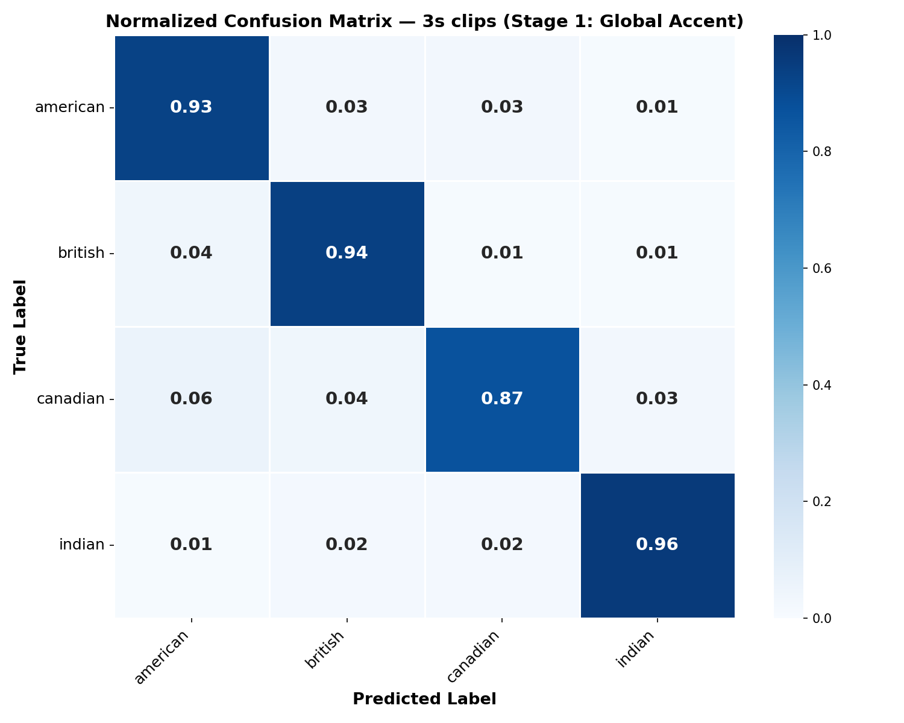

# 🎙️ Indian Accent Detector

An 8-class English accent classifier with **hierarchical Indian sub-accent detection** and **short-clip benchmarking** — built on Wav2Vec2, trained on Common Voice + Svarah.

---

## Research Gaps This Closes

Existing accent classification work has three key gaps that this project addresses:

### 1. No Short-Clip Benchmarking
Prior work (MPSA-DenseNet, AccentDB-CNN) evaluates only on clips ≥ 5 seconds. Real-world applications (voice assistants, call centers) often have only 1–3 seconds of speech. We benchmark accuracy across **1s, 2s, and 3s clips** and publish the degradation curve — nobody in the literature does this.

### 2. No Indian Sub-Accent Classification
All existing accent classifiers group Indian English into a single "Indian" category, ignoring the massive linguistic diversity across North/South/East/West India. We use the **Svarah dataset** to classify into 4 Indian sub-regions:
- 🇮🇳 **Indian-North**: Uttarakhand, Himachal, Punjab, Haryana, Delhi, UP, Rajasthan
- 🇮🇳 **Indian-South**: Tamil Nadu, Kerala, Karnataka, Andhra, Telangana
- 🇮🇳 **Indian-East**: West Bengal, Odisha, Assam, Bihar, Jharkhand, Northeast
- 🇮🇳 **Indian-West**: Gujarat, Maharashtra, Goa, Madhya Pradesh, Chhattisgarh

### 3. No Standardized Multi-Metric Evaluation
Prior papers report only overall accuracy. We provide:
- Per-class F1, precision, recall
- Normalized confusion matrices
- Clip-length accuracy curves
- All on one reproducible public train/val/test split with a manifest CSV

---

## Model Architecture

- **Base model**: `facebook/wav2vec2-base` (95M parameters)
- **Approach**: Transfer learning — CNN feature encoder (~7M params) is frozen, only the Transformer layers + 8-class classification head are fine-tuned
- **Training**: AdamW optimizer, cosine scheduler with 10% warmup, FP16 on GPU
- **Best model selection**: Macro F1 (not accuracy, to handle class imbalance)

```
Wav2Vec2 Feature Encoder (FROZEN)
        ↓
Wav2Vec2 Transformer Encoder (FINE-TUNED)
        ↓
Mean Pooling
        ↓
8-Class Classification Head (FINE-TUNED)
        ↓
Softmax → Accent Prediction
```

---

## Dataset

| Source | Classes | Samples | Purpose |
|--------|---------|---------|---------|
| [Common Voice 13.0](https://commonvoice.mozilla.org/) | American, British, Australian, Canadian | ~50K+ | Global accents |
| [Svarah](https://huggingface.co/datasets/iitb-monolingual/svarah) | Indian-North, Indian-South, Indian-East, Indian-West | ~10K+ | Indian sub-accents |

- Split: 80% train / 10% validation / 10% test (stratified by accent)
- Reproducible split manifest: `processed_data/split_manifest.csv`

---

## Results

### Overall Metrics by Clip Length

| Clip Length | Accuracy | Macro F1 | Weighted F1 |
|:-----------:|:--------:|:--------:|:-----------:|
| 1s          |    __    |    __    |     __      |
| 2s          |    __    |    __    |     __      |
| 3s          |    __    |    __    |     __      |

*Placeholder values — run `python evaluate.py` after training to populate.*

### Per-Class F1 by Clip Length

| Accent       | F1 (1s) | F1 (2s) | F1 (3s) |
|:-------------|:-------:|:-------:|:-------:|
| American     |   __    |   __    |   __    |
| British      |   __    |   __    |   __    |
| Australian   |   __    |   __    |   __    |
| Canadian     |   __    |   __    |   __    |
| Indian-North |   __    |   __    |   __    |
| Indian-South |   __    |   __    |   __    |
| Indian-East  |   __    |   __    |   __    |
| Indian-West  |   __    |   __    |   __    |

### Confusion Matrix (3s)



### Clip-Length Accuracy Curve


---

## Quickstart

```bash
# 1. Install dependencies
pip install -r requirements.txt

# 2. Prepare data (downloads + processes datasets)
python prepare_data.py

# 3. Train (all clip lengths)
python train.py --all

# 4. Evaluate
python evaluate.py

# 5. Launch demo
python app.py --share
```

For a quick test run:
```bash
python prepare_data.py --dry_run
python train.py --all --dry_run
python evaluate.py --dry_run
```

---

## Full Pipeline

### Step 1 — Data Preparation (`prepare_data.py`)
Downloads Common Voice English + Svarah, filters/maps accents, performs stratified 80/10/10 split, creates 3 clip-length variants (1s/2s/3s), and saves a reproducible manifest.

```bash
python prepare_data.py            # Full dataset
python prepare_data.py --dry_run  # 50 samples per class
```

### Step 2 — Training (`train.py`)
Fine-tunes Wav2Vec2 with frozen CNN encoder for each clip length. Uses macro F1 for model selection.

```bash
python train.py --all             # Train 1s, 2s, 3s
python train.py --clip_length 3   # Train only 3s
python train.py --all --dry_run   # Quick test
```

### Step 3 — Evaluation (`evaluate.py`)
Generates all research artifacts: per-class CSVs, confusion matrix PNGs, clip-length curves, and baseline comparison.

```bash
python evaluate.py                # Evaluate all clip lengths
python evaluate.py --clip_length 3 # Evaluate only 3s
```

Output files:
- `results/per_class_{N}s.csv` — per-class precision/recall/F1
- `results/confusion_matrix_{N}s.png` — normalized confusion matrix
- `results/confusion_matrix_{N}s.csv` — confusion matrix data
- `results/overall_metrics.csv` — accuracy + F1 across clip lengths
- `results/clip_length_curve.png` — F1 vs clip length plot
- `results/clip_length_curve.csv` — curve data

### Step 4 — Demo (`app.py`)
Gradio web UI with microphone/upload support and clip-length selector.

```bash
python app.py             # Local launch
python app.py --share     # Public URL
```

---

## File Structure

```
accent_detector/
├── config.py                  # All hyperparameters, labels, paths
├── prepare_data.py            # Data download + processing pipeline
├── train.py                   # Model training (per clip length)
├── evaluate.py                # Full evaluation pipeline
├── app.py                     # Gradio web demo
├── requirements.txt           # Python dependencies
├── README.md                  # This file
├── notebooks/
│   └── train_colab.ipynb      # Self-contained Colab/Kaggle notebook
├── processed_data/            # Generated by prepare_data.py
│   ├── clips_1s/
│   ├── clips_2s/
│   ├── clips_3s/
│   ├── split_manifest.csv     # Reproducible split (committed)
│   └── data_stats.json
├── accent-classifier-final/   # Generated by train.py
│   ├── clips_1s/
│   ├── clips_2s/
│   ├── clips_3s/
│   └── training_summary.json
├── results/                   # Generated by evaluate.py
│   ├── per_class_1s.csv
│   ├── per_class_2s.csv
│   ├── per_class_3s.csv
│   ├── confusion_matrix_1s.png
│   ├── confusion_matrix_2s.png
│   ├── confusion_matrix_3s.png
│   ├── confusion_matrix_1s.csv
│   ├── confusion_matrix_2s.csv
│   ├── confusion_matrix_3s.csv
│   ├── overall_metrics.csv
│   ├── clip_length_curve.png
│   └── clip_length_curve.csv
└── samples/                   # Example audio for Gradio demo
    ├── american_sample.wav
    ├── british_sample.wav
    └── indian_south_sample.wav
```

---

## Citation / Acknowledgements

### Datasets
- **Mozilla Common Voice 13.0**: Ardila, R., et al. (2020). "Common Voice: A Massively-Multilingual Speech Corpus." LREC 2020.
- **Svarah**: IIT Bombay. Indian accented English speech data.

### Models
- **Wav2Vec2**: Baevski, A., et al. (2020). "wav2vec 2.0: A Framework for Self-Supervised Learning of Speech Representations." NeurIPS 2020.

### Baselines Referenced
- **MPSA-DenseNet**: ~65% accuracy on accent classification (no Indian sub-regions, no per-class F1 reported)
- **AccentDB**: ~60% accuracy on accent classification (no Indian sub-regions)

### Tools
- [HuggingFace Transformers](https://huggingface.co/transformers/)
- [Gradio](https://gradio.app/)
- [PyTorch](https://pytorch.org/)
